# ARMS Manager

ARMS Manager is an application that allows the use of `tesseract-ocr` without using a command line interface. 

## Usage

To start using the application download the [latest executable (.exe)](https://github.com/diogoalmiro/arms-manager/releases) and run the file.

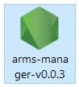

The application creates a server. To open the application go to [http://localhost:8006/](http://localhost:8006/).

It also creates a new system tray icon on the Windows Taskbar with the following options: 

 - **Open Webapp**: Opens the browser to access the application.

 - **Exit**: Closes the application.

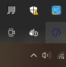
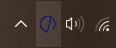
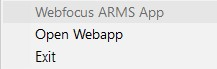

### Web interface

On the browser you will find the components: "Task Manager" and "Email Configuration".

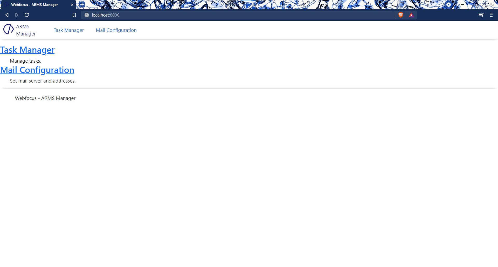

#### Task Manager

This component helps with the creation of docker containers to run the OCR workflow. 

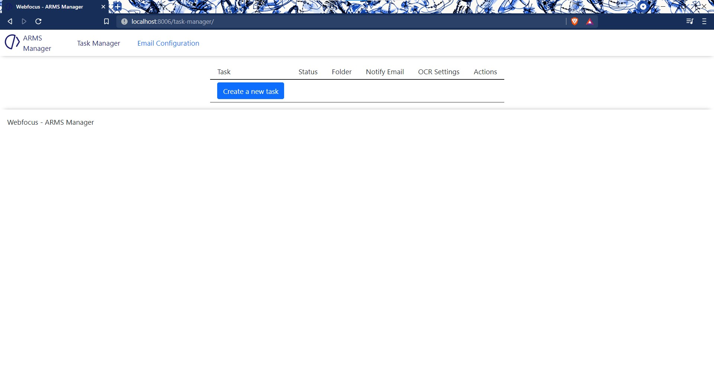

On the very first use there is only one available button "Create Task".
This button takes you to a page where you can select the folder to OCR. 

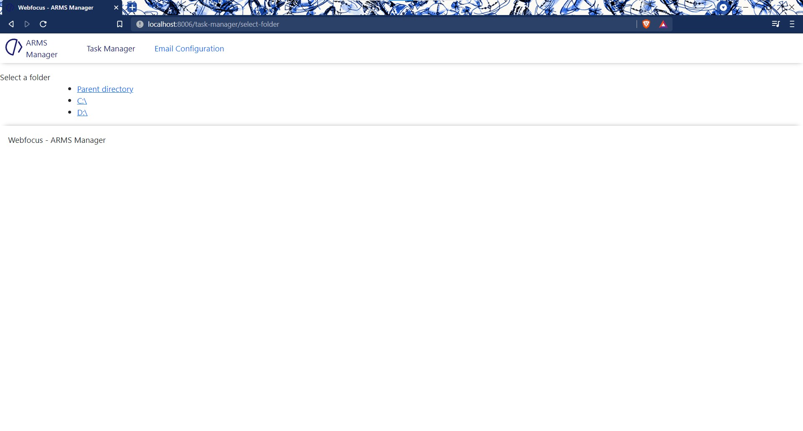

Once on the right location click "Create Task Here".

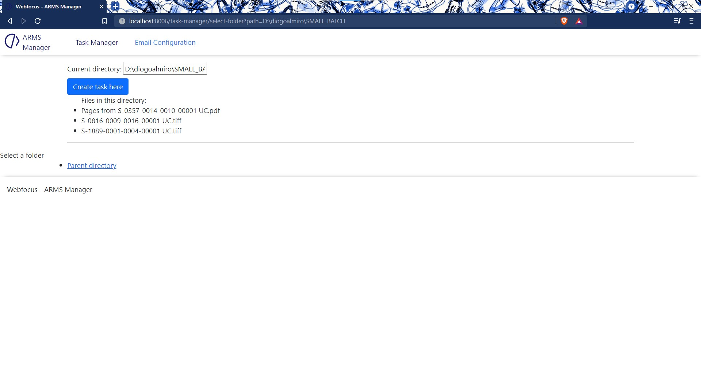

You are then redirected to the task specific location in this page you can:
 
 - See the task State:
    - **editable**: When the task was created but not yet runned.
    - **created**: When the docker container of the task was created. (It stays created until another container stops or pauses)
    - **User Paused**: When the user pauses a container.
    - **paused**: When the docker container was paused  by a user and there are other containers running.
    - **running**: When the docker container is running.
    - **exited**: When the docker container terminates.
 - See the events of that task:
   - **Inserted**: Time when task was created.
   - **Queued**: Time when the user pressed "Run".
   - **Started**: Time when the task actually started.
   - **Finished**: Time when the task terminated.
   - **Exit Code**: What was the task final state. (0 - No errors)
 - Specify the email address to notify when the OCR terminates.
 - Rename the task.
 - Set flags for the OCR and the dictionaries. (**Only when the task state is "Editable"**)
 - Set the priority of the task.(**Only when the task state is "Editable"**)
 - Save Settings, Delete Task, Run, Delete Container, Pause, Unpause
 - See the container logs. (Mostly helpful when the Exit Code is not 0)

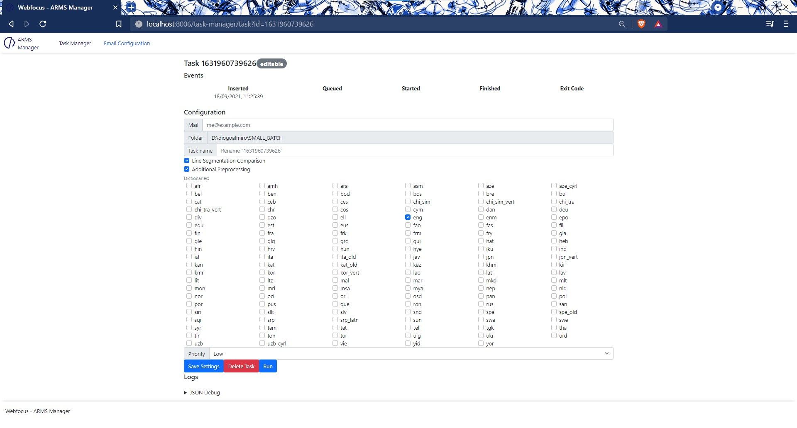

The task also appears on the Task Manager page with a smaller subset of options.

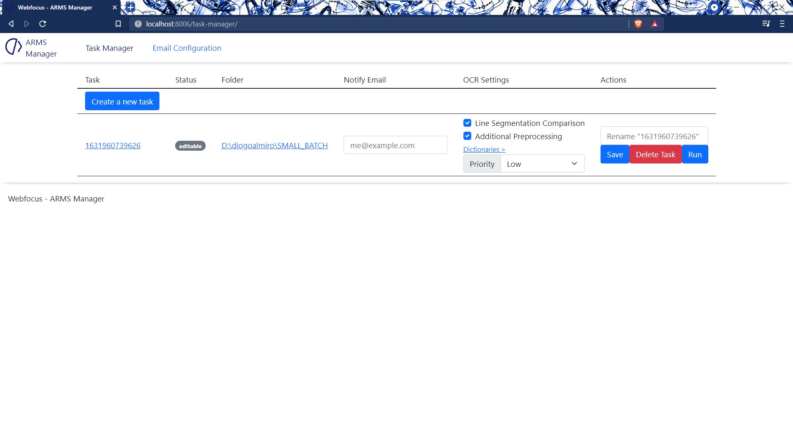

On the list of the Task Manager page the right most link opens the task specific page. The folder link opens the File Explorer on that folder. 

#### Email Configuration

The other available component allows you to set the configuration of the mail server (in case of any updates) and allows you to test the configuration.

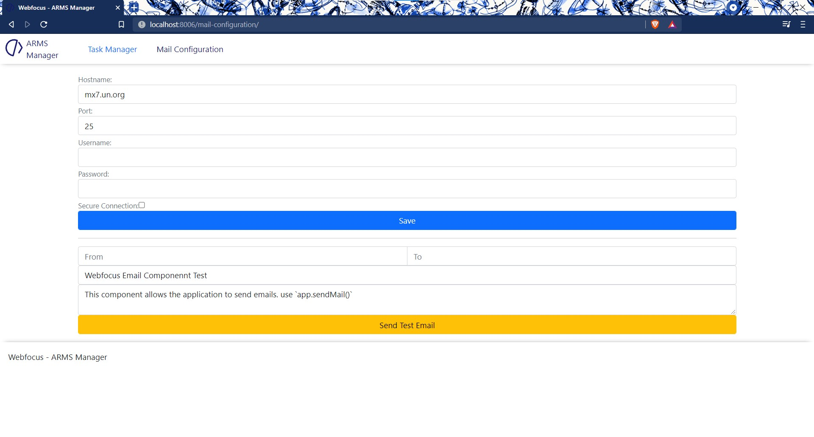